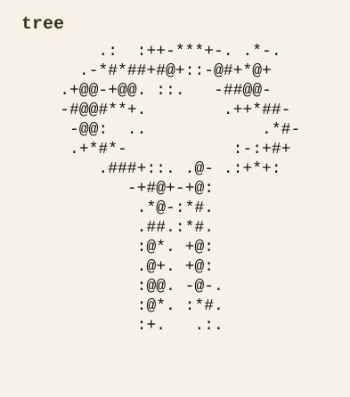
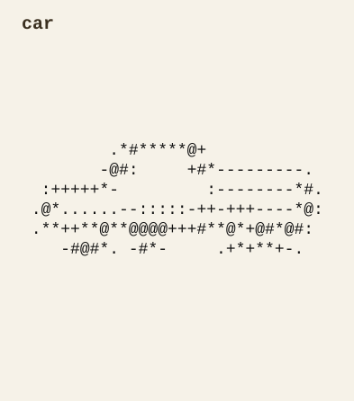
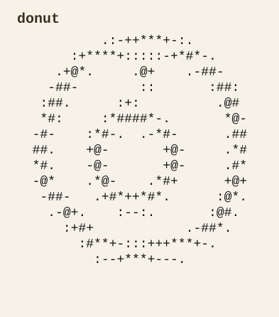
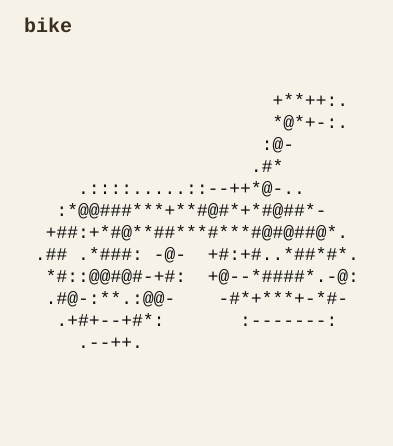
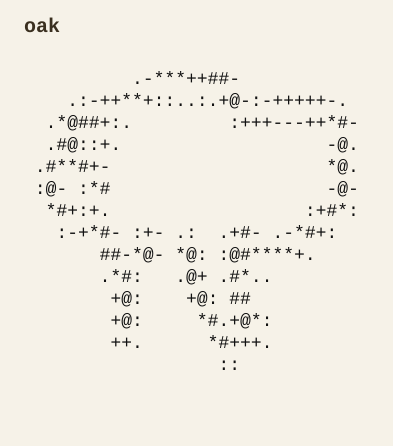
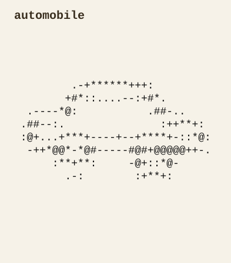
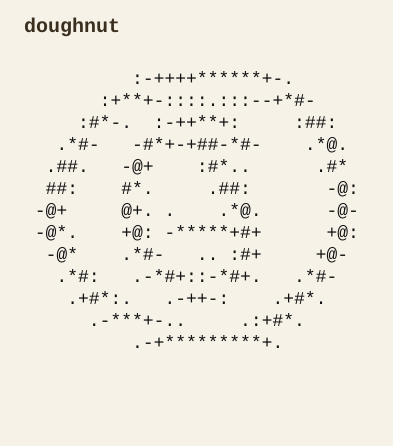
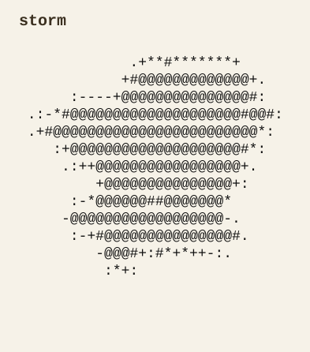
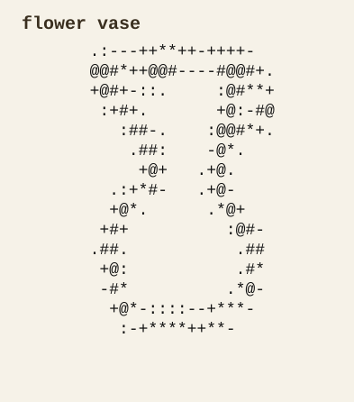
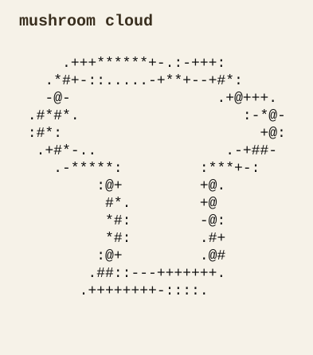

# ASCII Generator

`ASCII Generator` is a prompt-conditioned generative model for low-resolution ASCII sketches.

The final pipeline uses:

- a VAE to compress `32x16` ASCII token grids
- a CLIP-conditioned DiT to sample in the VAE latent space
- a small inference stack that runs locally on CPU

This repo is the cleaned-up end state of a learning project. It is not a product and it is not general text-to-image. It is a constrained, memorable ML demo built around a strange medium.

## What It Does

The model works best as **QuickDraw-style prompt-to-ASCII generation**:

- exact category prompts often produce recognizable structure
- alternate wording sometimes preserves the same concept
- nearby unseen prompts can land in the right semantic neighborhood
- composition and abstraction are much less reliable

The interesting result is not that ASCII is commercially useful. The interesting result is that a relatively compact latent diffusion pipeline can learn recognizable symbolic structure in an extremely low-resolution text domain.

## Showcase

### Direct Matches

`bicycle`


`tree`



`car`



`donut`



### Synonyms And Alternate Wording

`bike`



`oak`



`automobile`



`doughnut`



### Near-OOD Prompts

`storm`



`flower vase`



`mushroom cloud`



`dancer`


## How To Read The Results

The examples above are meant to show four different behaviors:

- **Direct matches**: prompts that are close to the training categories and tend to produce the strongest outputs
- **Synonyms**: prompts that are not necessarily exact labels, but still preserve recognizable structure
- **Near-OOD prompts**: prompts that are outside the exact training ontology but close enough to produce interesting approximations
- **Failures and limitations**: not shown yet in the gallery, but these are important for understanding the model honestly

Two examples are especially representative:

- `bicycle` -> `bike`: evidence that the model is not just doing brittle exact-label recall
- `storm`: evidence that the model can sometimes synthesize from nearby learned concepts like `hurricane`, `tornado`, and `cloud`

The model can also produce partial conceptual blends such as `flower vase` and `mushroom cloud`, although composition is inconsistent.

## What The Model Is Optimized For

This project made a few deliberate tradeoffs:

- low spatial resolution for cheap training and feasible CPU inference
- ASCII token grids instead of pixels
- QuickDraw-style categories instead of open-ended natural images
- prompt conditioning through CLIP rather than a larger text-native stack

Those choices make the project lightweight enough to run locally, but they also bound what the outputs can become.

## What It Can And Cannot Do

What it does reasonably well:

- recognizable objects from in-distribution prompts
- prompt sensitivity to alternate wording
- approximate semantic generalization within a narrow ontology

What it does poorly:

- abstract prompts
- complex scenes
- spatial relations
- reliable multi-object composition
- anything that depends on high-frequency detail

ASCII itself is also a real limitation: the outputs look best in monospace contexts, and copy/paste portability is fragile outside terminals, editors, and code blocks.

## Model And Sampling Defaults

Current default inference target:

- DiT: `local_data/models/checkpoints/dit_vae_full_250m/step_60000.pt`
- VAE: `local_data/models/checkpoints/vae_qd_full_b01/step_10000.pt`

Best current demo settings:

- `--sample-steps 50`
- `--guidance-scale 10`

Those two parameters matter a lot:

- more `sample_steps` usually improves structure and reduces undercooked noise
- higher `guidance_scale` pushes harder toward the prompt, but can also make samples brittle

## Running It

Install dependencies:

```bash
pip install -r requirements.txt
```

Run prompt-conditioned sampling:

```bash
python sample_prompts.py --prompts "bicycle" "car" "storm"
```

Use the recommended showcase settings:

```bash
python sample_prompts.py \
  --sample-steps 50 \
  --guidance-scale 10 \
  --prompts "bike" "oak" "automobile" "mushroom cloud"
```

## Exporting Gallery Assets

The repo includes an exporter that writes:

- raw `.txt` outputs
- crisp text-based `.svg` assets for GitHub
- a manifest with prompts, checkpoint, and sampling settings

Generate the current showcase set:

```bash
python export_showcase.py --device cpu --sample-steps 50 --guidance-scale 10
```

Outputs are written to `showcase_exports/`.

## Training

The repo is inference-first now, but the training path is still intact.

Rebuild the QuickDraw dataset if needed:

```bash
python build_quickdraw_full.py
```

Train the VAE:

```bash
python train_vae.py --train-npy local_data/quickdraw/full_32x16
```

Train the latent DiT:

```bash
python train_dit.py \
  --vae-checkpoint local_data/models/checkpoints/vae_qd_full_b01/step_10000.pt \
  --train-npy local_data/quickdraw/full_32x16
```

## Weights

Large checkpoints and datasets are not tracked in git.

The intended split is:

- keep code and showcase assets in GitHub
- host model weights separately

The `250m` checkpoint is the best demo model, but it is too large to treat as a normal git artifact. A Hugging Face model repo is the right home for it.

Local experiments, checkpoints, and datasets live under `local_data/`, which is intentionally ignored.

## Repo Structure

- `sample_prompts.py`: prompt-conditioned local sampling
- `export_showcase.py`: save showcase outputs as `.txt` and `.svg`
- `inference.py`: load the default pretrained pipeline
- `train_vae.py`: train the tokenizer VAE
- `train_dit.py`: train the latent diffusion transformer
- `build_quickdraw_full.py`: rebuild the QuickDraw dataset

## Notes

This project is best understood as a polished experiment in symbolic generative modeling.

It is small, weird, technically real, and honest about its limits. That is the point.
