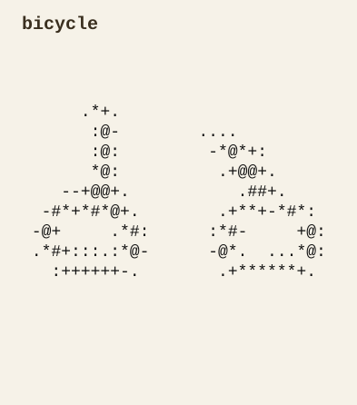
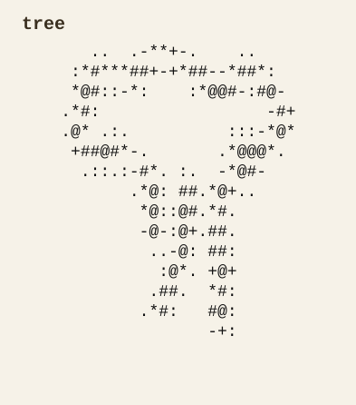
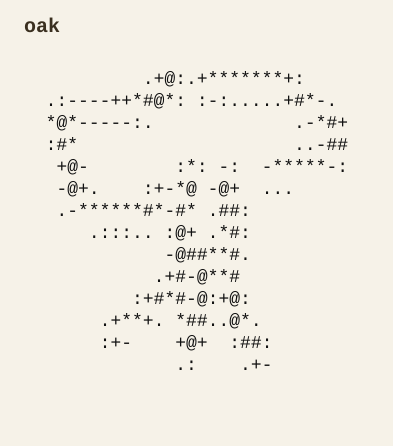
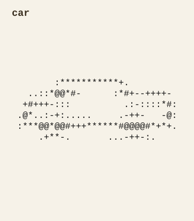
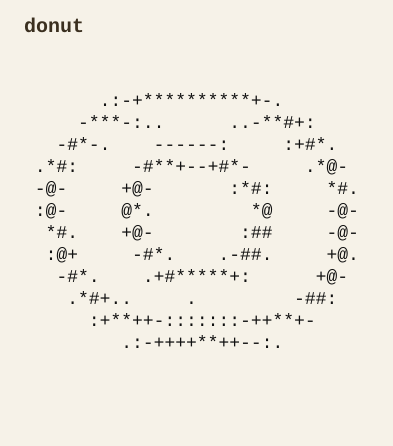
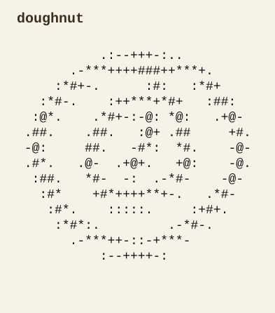
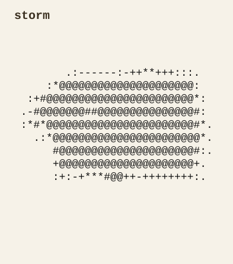
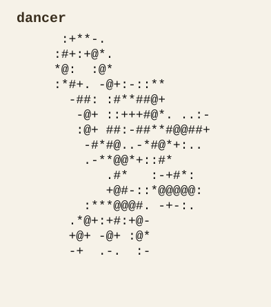

# ASCII Doodle

`ASCII Doodle` is a prompt-conditioned, 300M parameter generative model for ASCII sketches.

It uses:
- a VAE to compress `32x16` ASCII token grids
- a CLIP-conditioned DiT trained with flow matching to generate in the VAE latent space
- a small inference stack that runs locally on CPU

The result is a compact text-to-ASCII pipeline that can produce recognizable doodles, preserve structure across related prompts, and occasionally generalize beyond the exact training labels.

The model was trained on ASCII-converted examples of the 'Quick, Draw!' dataset. It performs best on simple, iconic objects. It is stable across related wording, and modestly capable of some near-out-of-distribution approximations and conceptual blends despite its limitations.

## Results

On prompts that are close to the 'Quick, Draw!' training distribution, the model learns to reproduce recognizable categories. The paired examples below show that this behavior is not limited to exact labels: CLIP-based prompt conditioning gives the model room to follow alternate wording while preserving the same underlying concept.

### Direct Matches vs. Alternate Wording

<table>
  <thead>
    <tr>
      <th>Direct Match</th>
      <th>Alternate Wording</th>
    </tr>
  </thead>
  <tbody>
    <tr>
      <td>
        <div><code>bicycle</code></div>
        <picture>
          <source media="(prefers-color-scheme: dark)" srcset="showcase_exports/01_group1_direct_bicycle_dark.svg">
          <source media="(prefers-color-scheme: light)" srcset="showcase_exports/01_group1_direct_bicycle_light.svg">
          
        </picture>
      </td>
      <td>
        <div><code>bike</code></div>
        <picture>
          <source media="(prefers-color-scheme: dark)" srcset="showcase_exports/05_group2_synonyms_bike_dark.svg">
          <source media="(prefers-color-scheme: light)" srcset="showcase_exports/05_group2_synonyms_bike_light.svg">
          
        </picture>
      </td>
    </tr>
    <tr>
      <td>
        <div><code>tree</code></div>
        <picture>
          <source media="(prefers-color-scheme: dark)" srcset="showcase_exports/02_group1_direct_tree_dark.svg">
          <source media="(prefers-color-scheme: light)" srcset="showcase_exports/02_group1_direct_tree_light.svg">
          
        </picture>
      </td>
      <td>
        <div><code>oak</code></div>
        <picture>
          <source media="(prefers-color-scheme: dark)" srcset="showcase_exports/06_group2_synonyms_oak_dark.svg">
          <source media="(prefers-color-scheme: light)" srcset="showcase_exports/06_group2_synonyms_oak_light.svg">
          
        </picture>
      </td>
    </tr>
    <tr>
      <td>
        <div><code>car</code></div>
        <picture>
          <source media="(prefers-color-scheme: dark)" srcset="showcase_exports/03_group1_direct_car_dark.svg">
          <source media="(prefers-color-scheme: light)" srcset="showcase_exports/03_group1_direct_car_light.svg">
          
        </picture>
      </td>
      <td>
        <div><code>automobile</code></div>
        <picture>
          <source media="(prefers-color-scheme: dark)" srcset="showcase_exports/07_group2_synonyms_automobile_dark.svg">
          <source media="(prefers-color-scheme: light)" srcset="showcase_exports/07_group2_synonyms_automobile_light.svg">
          
        </picture>
      </td>
    </tr>
    <tr>
      <td>
        <div><code>donut</code></div>
        <picture>
          <source media="(prefers-color-scheme: dark)" srcset="showcase_exports/04_group1_direct_donut_dark.svg">
          <source media="(prefers-color-scheme: light)" srcset="showcase_exports/04_group1_direct_donut_light.svg">
          
        </picture>
      </td>
      <td>
        <div><code>doughnut</code></div>
        <picture>
          <source media="(prefers-color-scheme: dark)" srcset="showcase_exports/08_group2_synonyms_doughnut_dark.svg">
          <source media="(prefers-color-scheme: light)" srcset="showcase_exports/08_group2_synonyms_doughnut_light.svg">
          
        </picture>
      </td>
    </tr>
  </tbody>
</table>

`ASCII Doodle` also shows a modest ability to extend beyond the exact training labels. It retains a rough sense of form on nearby out-of-distribution prompts and occasionally produces plausible conceptual blends, but the training set and model size are still far too limited for broad cross-domain generalization.

### Near-Out-of-Distribution Prompts

<table>
  <tbody>
    <tr>
      <td>
        <div><code>storm</code></div>
        <picture>
          <source media="(prefers-color-scheme: dark)" srcset="showcase_exports/09_group3_near_ood_storm_dark.svg">
          <source media="(prefers-color-scheme: light)" srcset="showcase_exports/09_group3_near_ood_storm_light.svg">
          
        </picture>
      </td>
      <td>
        <div><code>flower vase</code></div>
        <picture>
          <source media="(prefers-color-scheme: dark)" srcset="showcase_exports/10_group3_near_ood_flower-vase_dark.svg">
          <source media="(prefers-color-scheme: light)" srcset="showcase_exports/10_group3_near_ood_flower-vase_light.svg">
          
        </picture>
      </td>
    </tr>
    <tr>
      <td>
        <div><code>mushroom cloud</code></div>
        <picture>
          <source media="(prefers-color-scheme: dark)" srcset="showcase_exports/11_group3_near_ood_mushroom-cloud_dark.svg">
          <source media="(prefers-color-scheme: light)" srcset="showcase_exports/11_group3_near_ood_mushroom-cloud_light.svg">
          
        </picture>
      </td>
      <td>
        <div><code>dancer</code></div>
        <picture>
          <source media="(prefers-color-scheme: dark)" srcset="showcase_exports/12_group3_near_ood_dancer_dark.svg">
          <source media="(prefers-color-scheme: light)" srcset="showcase_exports/12_group3_near_ood_dancer_light.svg">
          
        </picture>
      </td>
    </tr>
  </tbody>
</table>

## Tradeoffs

This project made a few deliberate tradeoffs:

- low spatial resolution for cheap training and feasible CPU inference
- ASCII token grids instead of pixels
- QuickDraw-style categories instead of open-ended natural images
- prompt conditioning through CLIP rather than a larger text-native stack

Those choices make the model lightweight enough to run locally and strong on simple, iconic prompts. They also define its limits: it is best at single recognizable objects, reasonably good with related wording, and much weaker on complex scenes, spatial relations, abstraction, and fine detail. ASCII itself is part of the tradeoff too; the outputs look best in monospace contexts.

## Weights

The model weights live on Hugging Face:

- [wmargin/ascii-doodle](https://huggingface.co/wmargin/ascii-doodle/tree/main)

Download these two files:

- `dit_vae_full_250m_step_60000.pt`
- `vae_qd_full_b01_step_10000.pt`

Place them here:

```text
local_data/models/checkpoints/dit_vae_full_250m/step_60000.pt
local_data/models/checkpoints/vae_qd_full_b01/step_10000.pt
```

Manual download is simplest:

1. Open the [model page](https://huggingface.co/wmargin/ascii-doodle/tree/main).
2. Download both checkpoint files.
3. Put them in the paths above.

With the Hugging Face CLI:

```bash
mkdir -p local_data/models/checkpoints/dit_vae_full_250m
mkdir -p local_data/models/checkpoints/vae_qd_full_b01

hf download wmargin/ascii-doodle dit_vae_full_250m_step_60000.pt \
  --local-dir local_data/models/checkpoints/dit_vae_full_250m

hf download wmargin/ascii-doodle vae_qd_full_b01_step_10000.pt \
  --local-dir local_data/models/checkpoints/vae_qd_full_b01

mv local_data/models/checkpoints/dit_vae_full_250m/dit_vae_full_250m_step_60000.pt \
  local_data/models/checkpoints/dit_vae_full_250m/step_60000.pt

mv local_data/models/checkpoints/vae_qd_full_b01/vae_qd_full_b01_step_10000.pt \
  local_data/models/checkpoints/vae_qd_full_b01/step_10000.pt
```

## Running It

Install dependencies:

```bash
pip install -r requirements.txt
```

Recommended demo settings:

- `--sample-steps 60`
- `--guidance-scale 10`

Example:

```bash
python sample_prompts.py \
  --sample-steps 60 \
  --guidance-scale 10 \
  --prompts "bicycle" "bike" "storm" "mushroom cloud"
```

`sample_steps` and `guidance_scale` matter more than anything else at inference time: more steps usually improve structure, while higher guidance pushes harder toward the prompt but can make samples brittle.

## Training

The repo is centered on inference, but the training path is still included.

Rebuild the QuickDraw dataset if needed:

```bash
python build_quickdraw_full.py
```

Train the VAE:

```bash
python train_vae.py --train-npy local_data/quickdraw/full_32x16
```

Train the latent DiT:

```bash
python train_dit.py \
  --vae-checkpoint local_data/models/checkpoints/vae_qd_full_b01/step_10000.pt \
  --train-npy local_data/quickdraw/full_32x16
```
